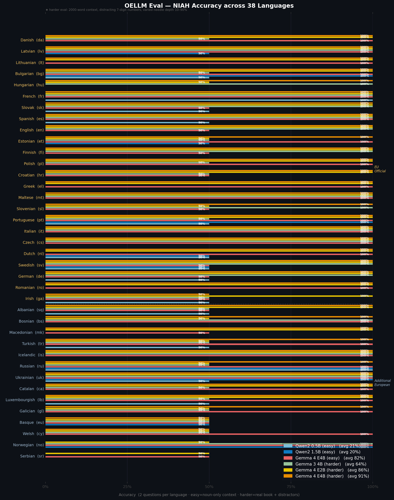

#  OneRuler

[](https://arxiv.org/pdf/2503.01996) 

`Paper`: [One ruler to measure them all: Benchmarking multilingual long-context language models](https://arxiv.org/pdf/2503.01996) 

`Authors`: Yekyung Kim, Jenna Russell, Marzena Karpinska, Mohit Iyyer

ONERULER is a multilingual benchmark designed to evaluate long-context language models across 26 languages. ONERULER adapts the English-only [RULER](https://arxiv.org/pdf/2404.06654) benchmark by including seven synthetic tasks that test both retrieval and aggregation, including new variations of the “needle-in-a-haystack” (NIAH) task that allow for the possibility of a nonexistent needle. We translate English instructions for each task and then collaborating with native speakers to translate them into 25 additional languages and experiment with both 5 open source and 2 closed model.

This code is based on [RULER's Repo](https://github.com/NVIDIA/RULER). 


## OpenEuroLLM language support

This local fork adds runtime support for the 38 languages listed by the OpenEuroLLM tokenizer:

* EU official plus English: `bg`, `hr`, `cs`, `da`, `nl`, `et`, `fi`, `fr`, `de`, `el`, `hu`, `ga`, `it`, `lv`, `lt`, `mt`, `pl`, `pt`, `ro`, `sk`, `sl`, `es`, `sv`, `en`
* Additional European: `sq`, `eu`, `bs`, `ca`, `gl`, `is`, `lb`, `mk`, `no`, `ru`, `sr`, `tr`, `uk`, `cy`

The original OneRuler resources are still used for languages that already shipped with the benchmark. The 21 newly added OELLM languages (`bg`, `hr`, `et`, `el`, `ga`, `lv`, `lt`, `mt`, `ro`, `sk`, `sl`, `sq`, `eu`, `bs`, `ca`, `gl`, `is`, `lb`, `mk`, `tr`, `cy`) each have:

* **Translated NIAH and CWE prompt files** in `OneRuler/data/prompt/{lang}/`
* **100 translated nouns** added as a column in `OneRuler/data/vocab/100_noun_list_translated.tsv`
* **A POS word list** in `OneRuler/data/vocab/dictionaries/{Language}/{Language}.csv`

When no book haystack is available for a language, the benchmark uses the translated noun list to construct distractor sentences, keeping the context in the target language rather than falling back to generated nonsense.

These resources are meant to make experiments runnable and reproducible. They should be validated with native-speaker prompt reviews and real distractor texts before using the scores as a publishable multilingual benchmark.

## Mini Eval — NIAH baseline across all 38 languages



The evaluation script (`scripts/run_oellm_mini_eval.py`) runs NIAH questions per language via a local Ollama model.  Two difficulty levels are shown in the figure above:

- **Easy** (`eval_results/mini_eval/`) — short noun-only haystack, needle is the only number present
- **Harder** (`eval_results/full_eval/`) — ~2000-word real book text (or synthetic sentences), ~10 distracting 7-digit numbers, needle depth varied across questions (10 %–90 %)

To reproduce:
```bash
# install Ollama: https://ollama.com
ollama pull gemma4

# harder eval (recommended)
python scripts/run_oellm_mini_eval.py --model gemma4 --num-predict 1024

# quick smoke-test without a model
python scripts/run_oellm_mini_eval.py --backend oracle --questions 2
```

Results (NIAH single, 2 questions per language):

| Model | Benchmark | Avg accuracy | Runtime | Notes |
|-------|-----------|-------------|---------|-------|
| `qwen2:0.5b` | easy | 21% | ~20s | — |
| `qwen2:1.5b` | easy | 20% | ~50s | — |
| `gemma4` ([google/gemma-4-E4B](https://huggingface.co/google/gemma-4-E4B), Q4) | easy | 82% | ~520s | token budget at 512 |
| `gemma3:4b` ([google/gemma-3-4b](https://huggingface.co/google/gemma-3-4b-it), Q4) | harder | 64% | ~141s | — |
| `gemma4:e2b` ([google/gemma-4-E2B](https://huggingface.co/google/gemma-4-E2B), Q4) | harder | **86%** | ~464s | — |
| `gemma4` ([google/gemma-4-E4B](https://huggingface.co/google/gemma-4-E4B), Q4) | harder | **91%** | ~726s | — |

Full per-language results are in `eval_results/`.

### Key findings

- **Gemma 4 E4B scores 91%** on the harder benchmark — the strongest result across all models tested.
- **Gemma 4 E2B scores 86%** — just 5 points below the E4B despite half the active parameters, completing the run in 64% of the time (~7.7 min vs ~12 min).
- **Gemma 3 4B scores 64%** — a dense 4B model, noticeably weaker than either MoE Gemma 4 variant on multilingual retrieval.
- **Norwegian and Serbian score 0%** on the E4B harder eval: the model retrieves the needle correctly but also reports a distractor number (multi-number answer when one is expected). The distractors are working.
- **Conclusion:** gemma4 MoE models have strong coverage for all 38 OELLM languages; the E2B is a compelling smaller alternative at 86% accuracy.

## 🗃️ Data Generation

1. Install requirement.txt
```bash
pip install -r requirement.txt
```

2. Check `prompt`, `books` and `vocabs` directories are existed!
   * `prompt`, `books` and `vocabs` translated to 26 languages will be in OneRuler/data/
   * `prompt`: Contains 26 directories with language codes, each having prompts for two tasks (`niah.txt` and `cwe.txt`)
     * `niah.txt`: Dictionary format. We divide NIAH template into partial instructions to ensure all variables can be substituted in templates without grammatical changes (e.g., singular/plural forms, gender variants).
   ```json
    {
      "task": "Please read and memorize the text below. I will ask you about it later.\n\n<text>\n{context}\n</text>\n\n",
      "needle_words": "The special magic word for \"{key}\" is: {value} ",
      "needle_numbers": "The special magic number for \"{key}\" is: {value} ",
      "question_single_numbers": "<Question> What special magic numbers associated with \"{query1}\" are mentioned in the provided text?",
      "question_single_words": "<Question> What special magic words associated with \"{query1}\" are mentioned in the provided text?",
      "question_multi_numbers": "<Question> What special magic numbers associated with \"{query1}\" and \"{query2}\" are mentioned in the provided text?",
      "question_multi_words": "<Question> What special magic words associated with \"{query1}\" and \"{query2}\" are mentioned in the provided text? ",
      "please_list": "Please list all that apply.",
      "if_no_numbers": "If no such numbers exist, please answer \"none\".</Question>\n\n\n",
      "if_no_words": "If no such words exist, please answer \"none\".</Question>\n\n\n",
      "answer_prefix": "Please provide your answer in the following format:\n",
      "answer_words": "<Answer> List all words here </Answer>",
      "answer_numbers": "<Answer> List all numbers here </Answer>",
      "none": "none"
     }
     ```
     * `cwe.txt`: Full instruction template
   ```txt
    {
      Below is a numbered list of words. In these words, some appear more often than others. Memorize the ones that appear most often.
      <List> {context} </List>
      <Question> What are the 10 most common words in the above list? </Question> 
      Please provide your answer in the following format:
      <Answer> List the words here </Answer>
     }
   ```
   * `books`: Each language has a book. This is used as a distractor in the `niah` task.
   * `vocabs`: Contains 1) `100_noun_list_translated.tsv` and 2) `dictionaries` of words in 26 languages
     * `100_noun_list_translated.tsv`: 100 selected nouns translated into 26 languages with descriptions. Each column represents a different language. It used for `niah` task.
     * `dictionaries`: Word lists with part-of-speech tagging. We used these for Common Word Extraction (`CWE`) task, filtered by nouns, adjectives, and verbs.

3. Check your config_task.sh and config_model.sh (located in `config` directory)
   * `config_task.sh`: This is for setting task configuration including number of samples and tasks to run.
   * `config_model.sh`: This is for setting which model to run for data generation and their configuration.

4. Run `run_data_generation.sh` or `run_data_generation_xling.sh`
   * Set your path of `HF_HOME`, `STANZA_RESOURCES_DIR` and save directory. Otherwise, Huggingface and Stanze will save model to your home directory.
   ```markdown
    export HF_HOME=''
    export STANZA_RESOURCES_DIR=''

    GPUS="1" # GPU size for tensor_parallel.
    ROOT_DIR="dataset" # the path that stores generated task samples and model predictions.
    MODEL_DIR="../.." # the path that contains individual model folders from HUggingface.
    CONFIG_DIR='./config/'
    ENGINE_DIR="." # the path that contains individual engine folders from TensorRT-LLM.
    BATCH_SIZE=1  # increase to improve GPU utilization
   ```
   * Run with arguments
     * Mono-lingual: bash run_data_generation.sh {model_name} synthetic {language_code}
     ```markdown
     bash run_data_generation.sh Llama3 synthetic ko
      ```
     * Cross-lingual: bash run_data_generation_xling.sh {model_name} synthetic {context_language_code} {instruct_langauge_code}
     ```markdown
     bash run_data_generation_xling.sh Llama3 synthetic ko en
      ```
## 🔬 Evaluation

Run eval/evaluate.py with arguments:
* `input_path`: Path to the input file to evaluate
* `task`: Task being evaluated
* `language`: Language of the evaluation
* `model_name`: Name of the model being evaluated
* If you generate dataset with the above steps, your data will be saved to a path like `/BASE_DIR/MODEL/LANGUAGE/CONTEXT/TASK/validation.jsonl`. This means that your data path contains information about task, language, context length, and model name, so feel free to modify the evaluation code for your convenience!


## 🕵️‍♀️ Trouble Shooting 

* If data generation is taking too long, check these common issues:
   1. For NIAH tasks: `Stanza` runs much slower on CPU. Using a GPU will significantly speed up data generation.
   2. The process might be silently stuck due to code issues. Since `prepare.py` uses `subprocess`, errors don't always show up. To troubleshoot, try running the printed command directly for better error visibility.
